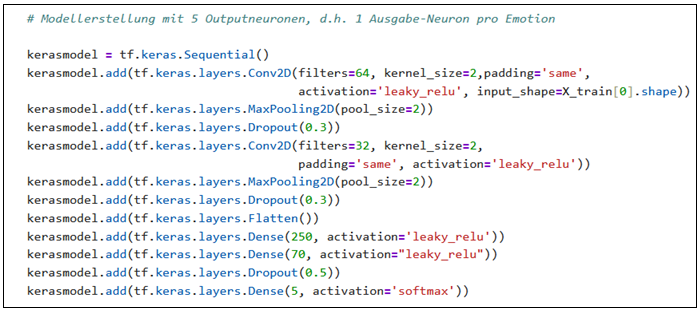

**Konferenzseminar vom 28.02.2026 an der Fachhochschule Südwestfalen im Wintersemesteer 2025/26**
**Dieses Repository enthält neben dem eigentlichen Konferenzpapier des Verfassers den für den Praxisteil / Kapitel 6 der Arbeit wichtigen Code in Form eines Jupyther-Notebooks zwecks Prüfung der Ergebnisse**

Thema: "Adversariale Attacken im Machine Learning - eine Systematisierung"

**Hintergründe zum Thema:**

Adversariale Angriffe offenbaren grundlegende Schwächen moderner KI-Systeme, da bereits minimale böswillige Manipulationen zu gravierenden Folgen führen können. Anhand eines trivialen Beispiels wird illustriert, welche gravierenden Folgen es haben könnte, wenn Datensätze ungeprüft in einen Trainingssatz aufgenommen und somit bspw. data oder backdoor poisoning in irgendeiner Form zugelassen wird.

Verwendet wird der "human-face-emotions"-Datensatz aus folgender Quelle:

**https://www.kaggle.com/datasets/samithsachidanandan/human-face-emotions**

Es wird ein Bildklassifikator hinsichtlich seiner fünf Emotionen (angry fear, happy, sad und surprise) erstellt. Der Datensatz ist relativ unausgewogen, da fast ein Drittel aller knapp 58.000 Bilder unter die Kategorie *happy* fallen, und *surprise* mit knapp 14% weit unter dem rechnerischen Durchschnittsanteil von 20% liegt. Aus diesem Grund wird der zum Training und Testen verwendete Datenauszug mit je 8.000 Bildern pro Emotion ausbalanciert. Klassisch wird anschließend unterteilt in einen Trainings-, Validierungs- und Testdatensatz. Modellgrundlage ist folgendes Keras-Sequential-Modell:



Das Training erstreckt sich über 50 Epochen und die Ergebnisse und Arbeitsfluss sind im gespeicherten [📄 Jupyther-Notebook](Konferenzseminar_Kapitel_6_data_poisoning.ipynb) einzusehen samt confusion matrix.

**Struktur des Repository**
```text
.
├── arbeit/
│   └── ausarbeitung_conference_papier.pdf
├── code/
│   └── Konferenzseminar_Kapitel_6_data_poisoning.ipynb
├── images/
│   └── keras_model_git.png
└── README.md
```

**Resultate**

- Genauigkeit im "baseline"-Datensatz OHNE data poisoning       : **61.9%**
- Genaugkeit MIT poisoning (12.5% der Label manipuliert)        : **51.2%**
- Erfolgsrate des backdoor-triggers (3x3 Pixel)mittige Position : **100%**
- Erfolgsrate des backdoor-triggers (3x3 Pixel) oben links      : **61%**
- Erfolgsrate des backdoor-triggers (2x2 Pixel) oben links      : **0,8%**

**Lizenz & Kontakt**
keine Lizenz

**Kontakt**
Verfasser der Arbeit: Harry Lohr
